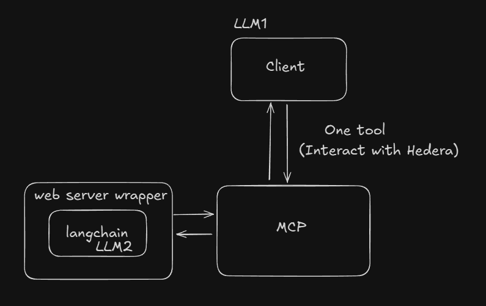

# Introduction

Let's discover **Hedera MCP Server**.

## What is Hedera MCP?
This project provides a server that integrates with a Langchain wrapper to interact with the Hedera network. It allows users to perform Hedera operations through natural language commands facilitated by the Langchain setup.

## Key Features
The core purpose of the Hedera MCP server is to simplify working with Hedera by providing convenient actions that allow you to easily prepare or submit transactions, create tokens, send airdrops, check messages on topics, and much more.

Thanks to our MCP server, you can interact with Hedera in a fast and straightforward way—directly from your favorite client that supports SSE communication and header transmission, such as VS Code.

## Architecture
 

## Installation
- [Quick start](/mcp-server/quick-start)
- [How to use](/mcp-server/how-to-use)